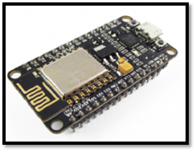
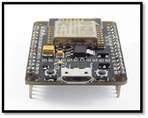
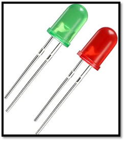
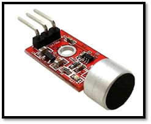
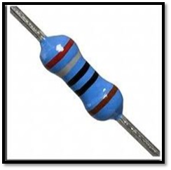
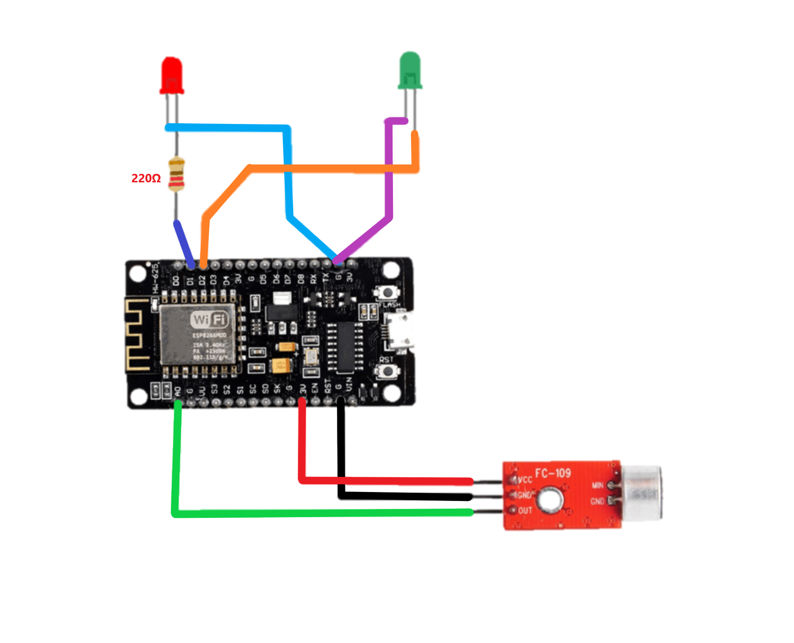

# **Noise Detector**
*Noise detector es un instrumento que nace, bajo la necesidad de medir los niveles de contaminación acústica en algún lugar en específico.*

El proyecto está dirigido para los lugares que necesitan poca contaminación acústica ó, en su defecto mucho silencio, tales como:
+ Bibliotecas
+ Centros de estudio 
+ Edificios 
+ Hospitales

Socialmente hablando, el vivir de la gente hoy en dia se orienta en edificios de gran envergadura donde viven mucha gente en ellos, y por reglas de convivencia se debe tener en consideración el volumen después de determinadas horas.

## Implementación del Proyecto

Para esta implementación se programará un dispositivo **NodeMCU** el cuál nos permitirá conectarnos inalámbricamente (WiFi) a nuestro dispositivo móvil, de manera adicional a través de un sensor de sonidos **FC-109**, que posee una capacitancia pequeña, detectará intervalos de DB desde 0 a 80 Decibeles, lo cual nos permite hacer pequeñas experimentaciones en lugares pequeños, creemos que con un dispositivo más avanzado como un micrófono podemos experimentar con parámetros más altos para evolucionar el proyecto.

Por otro lado, la aplicación **Android** presentara distintos parámetros, como los niveles de decibeles que recepciona del sensor, los cuales podremos ver a través de una interfaz gráfica. Esto hará que en nuestro teléfono podamos ver 
los niveles de contaminación acústica que hay en cada zona en la que se esté presente. 

De manera física, el dispositivo tendrá la capacidad de representar esto a través de **2 diodos LED**, que nos dirá de manera intuitiva, si hay contaminación acústica en el lugar. Para esto el dispositivo está configurado para que cuando este entre los rangos de 40 a 60 decibeles, se encienda el LED verde, el cuál indica que se encuentra en un ambiente grato sin contaminación excesiva. Y si se supera este rango se encenderá el LED rojo, el cuál indica que hay contaminación acústica en dicho lugar. *Todo esto se ve reflejado en la aplicación Android en paralelo.*

## Lista de Materiales
### **NodeMCU V2 ESP8266 WiFi**
#### Especificaciones Técnicas
* Voltaje de Alimentación: 5V   
* Voltaje de Entradas/Salidas: 3.3V DC (No usar 5V)
* Placa: NodeMCU v2 (Amica)
* Chip conversor USB-serial: CP2102
*	SoM: ESP-12E (Ai-Thinker)
*	SoC: ESP8266 (Espressif)
*	CPU: Tensilica Xtensa LX3 (32 bit)
*	Frecuencia de Reloj: 80MHz/160MHz
*	Instruction RAM: 32KB
*	Data RAM: 96KB
*	Memoria Flash Externa: 4MB
*	Pines Digitales GPIO: 17 (4 pueden configurarse como PWM a 3.3V)
*	Pin Analógico ADC: 1 (0-1V)
*	Puerto Serial UART: 2
*	Certificación FCC
*	Antena en PCB
*	802.11 b/g/n
*	Wi-Fi Direct (P2P), soft-AP   
*	Stack de Protocolo TCP/IP integrado
*	PLLs, reguladores, DCXO y manejo de poder integrados
*	Potencia de salida de +19.5dBm en modo 802.11b
*	Corriente de fuga menor a 10uA
*	STBC, 1×1 MIMO, 2×1 MIMO
*	A-MPDU & A-MSDU aggregation & 0.4ms guard interval
*	Wake up and transmit packets in < 2ms
*	Consumo de potencia Standby < 1.0mW (DTIM3)
*	Pulsador RESET y FLASH
*	Leds indicadores: 2
*	Dimensiones: 49*26*12 mm
*	Peso: 9 gramos
---
### **DIODO LED ROJO Y VERDE**
#### Especificaciones Técnicas  
*	Referencia y color: BL-B5141 / BL-B2141  
*	Cápsula (diámetro): 3 mm / 3 mm 
*	Luminosidad: 10 mcd / 40 mcd     
*	Longitud de onda: 700 nm / 568 nm
*	Ángulo: 40º / 35º
*	Corriente de alimentación: 20 mA / 20 mA
*	Tensión de alimentación: 2,2 - 2,6 VDC / 2,2 - 2,6 VDC 
---
### **SENSOR DE SONIDO FC-109**
#### Especificaciones Técnicas
*	Alimentación: 3.3 a 5 V DC    
*	Permite detectar la intensidad de sonido del entorno
*	Incorpora un amplificador de audio MAX9812      
*	Posee un orificio de instalación para facilitar su uso y montaje
*	Construido con un LED Indicador de alimentación
*	Conexión de 3 hilos
*	Dimensiones: 26 x 12 x10 mm
---
### **RESISTENCIA DE 220Ω**
#### Especificaciones Técnicas
*	Tipo de elemento resistivo:  Oxido metálico   
*	Tipo: Carbón
*	Rango temperatura de operación: -55 a 20°C    
*	2 pines (axial)
*	Resistencias de metal con una precisión de +-5% de tolerancia.
*	Potencia nominal: 1/4 W
*	Máxima tensión nominal: 300 V
*	Resistencia: 220 Ohm

## Esquema del Circuito

# **Integrantes del Proyecto**
***Andres Bustos, Isidora Pizarro, Alvaro Rojas. Instituto Profesional Santo Tomás, San Joaquín 2022***
